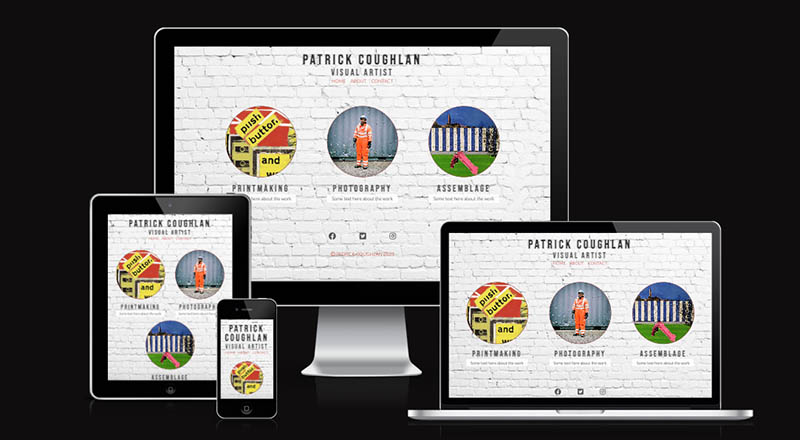
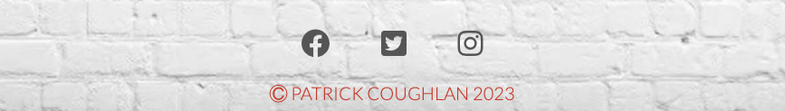

# Patrick Coughlan - Artist's Website

A simple, responsive artist's portfilio site built entirely in HTML and CSS

## Author

Patrick Coughlan
- [@p-coughlan](https://www.github.com/p-coughlan)

## 🛠 Skills
HTML, CSS...

## About

Patrick Coughlan | Visual Artist is a website created to serve as a platform to showcase a range of practices in clearly labelled sections. It provides information on the sections and features a simple form to enable users to subscribe to a mailing list and leave optional feedback or query if desired.
## Screenshots

## User Stories
As a first-time visitor, I expect to navigate through the site with ease, view artwork in clearly defined sections, and gain an understanding of the artist's processess.

As a returning visitor, I would look to see updated galleries and information on upcoming shows or collaborative projects.

As a frequent user, I expect to easily find contact information and mailing list subscribe option so I could pose any questions and recieve information regarding future events.

## Design
The website employs a minimalist design with a 'studio' feel. The use of the white painted brick wall adds a little textural warmth.

## Color Scheme
The main colour elements come form the artwork itself. Varying greys have been used in heading elements and borders such as #111, #333 and #555. Additionally I used an eye dropper tool to pick out colours from the gallery link 'thumbnails' on the main page. These colours (#c83b27 and #3b5f9d) are used in the navigation links at the top of the page and in the copyright information in the footer. 

## Typography
Fonts for the website are sourced from Google Fonts.

The font 'Bebas Neue', designed by Ryoichi Tsunekawa is used for all headings and subheadings, is a bold uppercase font that has a strong visual impact.

The font used for paragraphs and form elements is 'Lato', designed by Łukasz Dziedzic. It is similar to Gil Sans and is a very readable sans-serif font.

## Imagery
All imagery on the site is original artwork by the artsist - Patrick Coughlan. The only exception to this is the 'white painted brick wall" image that forms the background across all the pages of the site (information below in credits). Images were all resized in photoshop and saved as jpeg files generally within the 40-60kb range to ensure smoother performance of the website.

## Features

- Fully Responsive Design - The website is designed to be responsive to a variety of devices, such as mobile phones, tablets, laptops, and desktop computers.

- Interactive Navigation Menu - The easy-to-use navigation menu allows users to navigate around the site with ease. It features a hover effect to encourage users to interact and navigate through the website.

- Home Page - The simple homepage uses striking circular thumbnail gallery images which offer the user to browse work by category (Printmaking, Photography and Assemblage). The gallery icons have a hover function that make the image slightly opaque when hovered over. This provides a sense of interactivity and encourages the user to click to navigate through the site.

## Languages, Tools & Technologies Used

* HTML
* CSS
* Photoshop
* Codeanywhere IDE
* Github
* Google Fonts
* Font Awesome
* Balsamiq Wireframe Tool

## Deployment

### GitHub Pages

#### To deploy the site through GitHub pages, follow these steps:

* Log in to GitHub and navigate to the GitHub Repository.

* Click on the gear icon for settings.

* Find the GitHub Pages section and click on the 'Check it out here!' link.

* Under the Source header, select 'main' from the dropdown menu and choose the folder '/ (root)'.

* Click on Save.

* After the page refreshes, locate the published website link found under the GitHub Pages header.

### Forking the GitHub Repository

#### If you wish to create a safe copy of the project to experiment with changes, follow these steps:

* Log in to GitHub and navigate to the GitHub Repository.

* Click the "Fork" button near the top of the page to create a copy of the repository.

### Making a Local Clone

* Under "Clone with HTTPS", click the clipboard icon to copy the link.

* Open Git Bash and change the current working directory to the location where you want the cloned directory.

* Type 'git clone', add a space, and paste the URL that was copied earlier (in step 4). Press enter to create a clone.

For a more detailed guide with screenshots, click [here.](https://docs.github.com/en/repositories/creating-and-managing-repositories/cloning-a-repository#cloning-a-repository-to-github-desktop)

## Validator Testing

Both the HTML5 and CSS code was put through WSC validators.

HTML5 passed with a warning that I decided was best not to change as it would have ment incorporating an unnecessary div element.

Css3 passed without errors.

Lighouse showed good scores.

## Roadmap
What will I improve / work on in the future?

## Credits

Credits here --
## Acknowledgements

 - [Masonry Gallery Template by Omar Trujillo](https://codepen.io/CyFox/pen/MWWEwjg)
 - [Background Image Source](https://tinyurl.com/yfenv9ym)
 - [README editor](https://readme.so/)
 - [Google Fonts](https://fonts.google.com/)
 - [Eyedropper Tool](https://eyedropper.org/)

